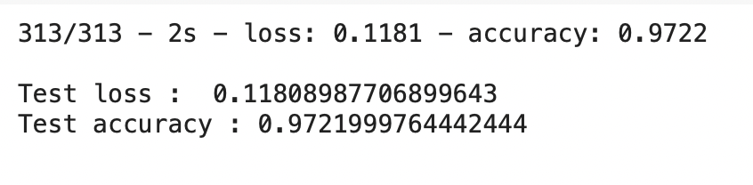
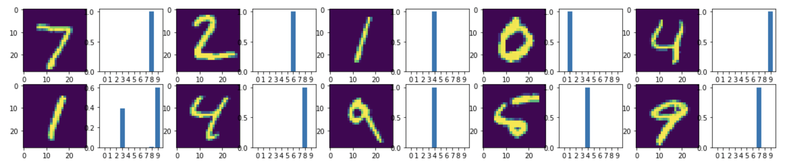
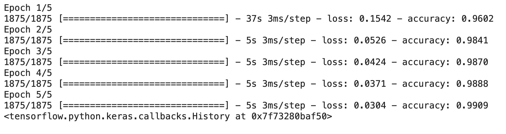
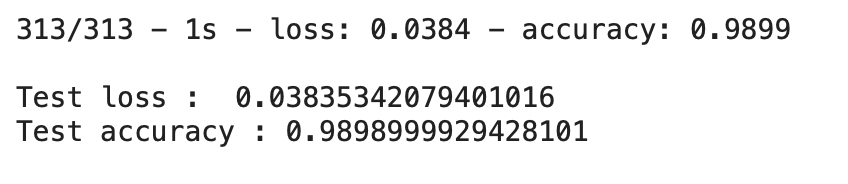
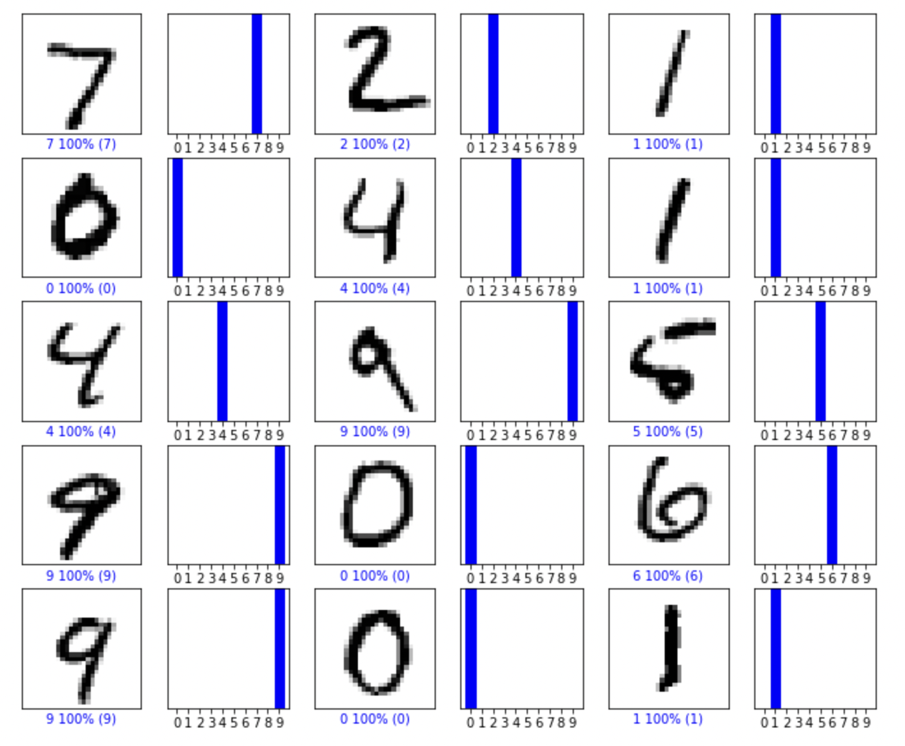

# hand_written_digit_classification
## MODEL 1 : 3 Layers with 1 Convolution layer

1. Training with Training loss

2. Test Accuracy

3. Images and corresponding probability that predicted Right

4. Images and corresponding probability that predicted Wrong

## MODEL 2 : 3 Layers with 1 Convolution layer

1. Training with Training loss

2. Test Accuracy

3. Images and corresponding probability that predicted Right

4. Images and corresponding probability that predicted Wrong

## MODEL 3 : 3 Layers with 1 Convolution layer

1. Training with Training loss

2. Test Accuracy

3. Images and corresponding probability that predicted Right

4. Images and corresponding probability that predicted Wrong

